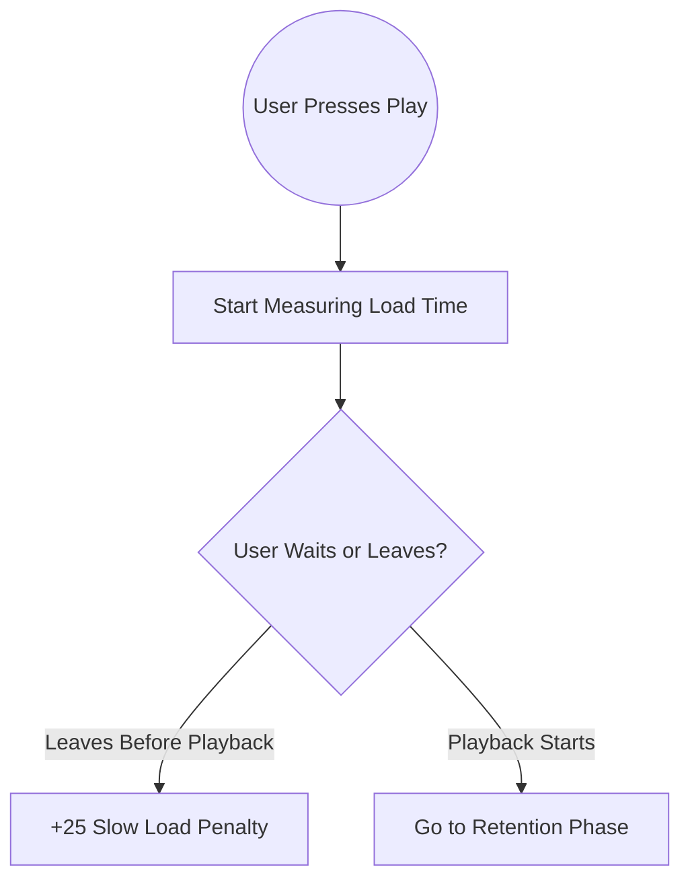

# **bitvid: Updated Plan with VRR (View, Rating, and Retention) Penalty Scoring**

## **Project Overview**

**Objective**  
Enable a decentralized video platform where every view and engagement action is logged via the Nostr protocol (NIP-78). This system incorporates both interval-based watch tracking and a penalty scoring method for short watch times (potentially due to slow loading or immediate disinterest).

**Key Features**  
1. Track video views and user retention at regular intervals.  
2. Assign penalty scores if a viewer leaves within certain short-watch thresholds.  
3. Use this data to power more accurate recommendations.  
4. Maintain user privacy by supporting logged-in (persistent pubkey) and session-based (temporary pubkey) tracking.

---

## **Technical Requirements**

1. **Video View Tracking**  
   - **Event Trigger**  
     - A “view” event is sent to a relay whenever a user starts playing a video.  
     - Subsequent engagement events (interval updates, exit events) follow.  
   - **Data Logged**  
     - Video ID or magnet URI.  
     - Viewer’s pubkey (for logged-in) or session-based key (for guests).  
     - Timestamps and session details.  
   - **Nostr Protocol Usage**  
     - Build on NIP-78, using `kind: 30078` events.  

2. **Non-Logged-In User Tracking**  
   - Generate an ephemeral key pair on session start.  
   - Mark the event with something like `["session", "true"]` to distinguish it from a persistent account.  
   - Discard the key pair when the session ends.

3. **Recommendations**  
   - **Algorithm**  
     - Combine tags, watch intervals, exit penalty scores, and metadata for ranking.  
   - **Presentation**  
     - Show recommended content in a sidebar or beneath the video player.  
   - **Filters**  
     - Exclude deleted or private content unless the user owns it.

4. **User Privacy**  
   - Provide an opt-in or opt-out setting for tracking.  
   - Collect minimal data to preserve user autonomy.  
   - Consider encryption or obfuscation for private data.

5. **Performance Considerations**  
   - Batching events to avoid overwhelming relays (e.g., every 5 seconds or in small groups).  
   - Index or cache data to speed up recommendations.

---

## **Functional Components**

1. **Event Structure**

   **Regular View Event (Start)**
   ```json
   {
     "kind": 30078,
     "pubkey": "user_pubkey_or_temp_key",
     "created_at": 1672531200,
     "tags": [
       ["t", "view"],
       ["video", "video_id"]
     ],
     "content": "{\"videoId\":\"video_id\",\"timestamp\":1672531200}"
   }
   ```

   **Interval/Retention Event (5-second, 10-second, etc.)**
   ```json
   {
     "kind": 30078,
     "pubkey": "user_pubkey_or_temp_key",
     "created_at": 1672531234,
     "tags": [
       ["t", "video-watch"],
       ["video", "video_id"]
     ],
     "content": "{\"timestamp\":1672531234,\"currentWatchSeconds\":10}"
   }
   ```

   **Exit Event (With Penalty Score)**
   ```json
   {
     "kind": 30078,
     "pubkey": "user_pubkey_or_temp_key",
     "created_at": 1672531300,
     "tags": [
       ["t", "vrr-exit"],
       ["video", "video_id"]
     ],
     "content": "{\"watchTime\":4,\"score\":25}"
   }
   ```

2. **UI Updates**  
   - **Video Player**  
     - Trigger events when the video starts, at regular intervals, and upon exit.  
   - **Recommendations**  
     - Fetch and rank videos based on a combination of watch intervals, exit scores, and content tags.

3. **Integration Points**  
   - **Frontend**  
     - Implement functions like `trackViewEvent()` and `applyPenaltyScore()` in a dedicated module.  
   - **Backend/Relay**  
     - Store, relay, and retrieve events for analytics and recommendation algorithms.

4. **Development Workflow**  
   - **videoTracker.js**  
     - Contains the VRR methods: initial view events, interval tracking, penalty scoring on exit.  
   - **app.js**  
     - Orchestrates user interactions, calls into `videoTracker.js` on playback, stopping, etc.  
   - **HTML/CSS**  
     - Builds out a recommendations display area or scoreboard for each video.

---

## **VRR (View, Rating, and Retention) Method**

### **Penalty (or Bonus) Scoring for Early Exits**

| Watch Time <br>(seconds) | Score |
|--------------------------|-------|
| 0–5                      | +25   |
| 5–10                     | +20   |
| 10–15                    | +15   |
| 15–20                    | +10   |
| 20–25                    | +5    |
| 25–30                    | +0    |

- Immediately grant **+1** view when the video starts.  
- If the user leaves before the thresholds listed above, publish an exit event with the corresponding score.  

### **Interval-Based Retention Tracking**
- Send an update every 5 seconds (5s, 10s, 15s, etc.) while a video is actively playing.
- Each interval event stores current watch progress for analytics.

### **Example Score Usage**
- Final overall “video health” may sum interval engagement with exit penalties.  
- Videos consistently abandoned at under 5 seconds might be flagged for slow loading or poor content.  
- The combination of interval events and exit events builds a complete retention profile.

---

## **Implementation Examples**

### **1. `videoTracker.js`**

```javascript
// videoTracker.js

class VideoTracker {
  constructor(videoId, totalDuration, nostrClient) {
    this.videoId = videoId;
    this.totalDuration = totalDuration;
    this.nostrClient = nostrClient;
    this.startTimestamp = null;
    this.trackingInterval = null;
  }

  startVideo() {
    this.startTimestamp = Date.now();

    // Send initial "view" event (+1 View)
    const startEvent = {
      kind: 30078,
      tags: [
        ["t", "view"],
        ["video", this.videoId]
      ],
      content: JSON.stringify({
        videoId: this.videoId,
        timestamp: this.startTimestamp
      })
    };
    this.nostrClient.publish(startEvent);

    // Kick off interval tracking every 5 seconds
    this.trackingInterval = setInterval(() => {
      const currentTime = Date.now();
      const watchSeconds = Math.floor((currentTime - this.startTimestamp) / 1000);

      const watchEvent = {
        kind: 30078,
        tags: [
          ["t", "video-watch"],
          ["video", this.videoId]
        ],
        content: JSON.stringify({
          timestamp: currentTime,
          currentWatchSeconds: watchSeconds
        })
      };
      this.nostrClient.publish(watchEvent);
    }, 5000);
  }

  stopVideo() {
    // Clear interval-based tracking
    if (this.trackingInterval) {
      clearInterval(this.trackingInterval);
      this.trackingInterval = null;
    }

    // Compute how long the user actually watched
    if (!this.startTimestamp) return;
    const stopTimestamp = Date.now();
    const totalWatchSeconds = Math.floor((stopTimestamp - this.startTimestamp) / 1000);

    // Apply penalty scoring
    let score = 0;
    if (totalWatchSeconds < 5) {
      score = 25;
    } else if (totalWatchSeconds < 10) {
      score = 20;
    } else if (totalWatchSeconds < 15) {
      score = 15;
    } else if (totalWatchSeconds < 20) {
      score = 10;
    } else if (totalWatchSeconds < 25) {
      score = 5;
    }

    // Publish exit event with score
    const exitEvent = {
      kind: 30078,
      tags: [
        ["t", "vrr-exit"],
        ["video", this.videoId]
      ],
      content: JSON.stringify({
        watchTime: totalWatchSeconds,
        score
      })
    };
    this.nostrClient.publish(exitEvent);

    // Reset startTimestamp for the next session
    this.startTimestamp = null;
  }
}

export default VideoTracker;
```

### **2. Integrating with `app.js`**

```javascript
// app.js

import VideoTracker from './videoTracker.js';

class bitvidApp {
  constructor(nostrClient) {
    this.nostrClient = nostrClient;
    this.videoTracker = null;
  }

  playVideo(video) {
    // video might have id and totalDuration properties
    // e.g., { id: 'abc123', totalDuration: 300 }
    this.videoTracker = new VideoTracker(video.id, video.totalDuration, this.nostrClient);
    this.videoTracker.startVideo();

    // ... code to actually play the video in the UI ...
  }

  stopVideo() {
    if (this.videoTracker) {
      this.videoTracker.stopVideo();
      this.videoTracker = null;
    }
  }
}

export default bitvidApp;
```

---

## **Recommendation Data Flow**

1. **Collect**:  
   - Gather interval events and exit penalty events from each viewer.  
2. **Analyze**:  
   - Identify average watch times and drop-off points.  
   - Rank videos that hold attention for longer while penalizing those with frequent early exits.  
3. **Display**:  
   - Show suggested content to viewers in a recommendations section.  
   - Optionally expose a public graph or chart showing user retention for each video.

---

Below is a combined reference that shows two separate Mermaid flowcharts:

1. **Load Time Penalty** — for users who abandon the video **before** playback actually begins.  
2. **Retention Tracking** — for users who start watching and either trigger a short-watch penalty or get a “no penalty” bonus for watching beyond 25 seconds.

---

## **1. Load Time Penalty**



**Explanation**  
- The moment the viewer clicks "Play," you begin tracking load time.  
- If the user abandons before the video actually begins, you apply a **“slow load penalty”** (e.g., +25).  
- If playback starts successfully, move on to the retention phase.

---

## **2. Retention Tracking (Penalty or Bonus)**

```mermaid
flowchart TB
    A([Playback Begins]) --> B([+1 View Logged])
    B --> C{"User Exits?\n(X seconds watched)"}
    C -- "&#60;5s" --> D([+25 Penalty])
    C -- "&#60;10s" --> E([+20 Penalty])
    C -- "&#60;15s" --> F([+15 Penalty])
    C -- "&#60;20s" --> G([+10 Penalty])
    C -- "&#60;25s" --> H([+5 Penalty])
    C -- "&#62;=25s" --> I([No Penalty or Bonus])
```



**Explanation**  
1. **Immediate View (+1)**: Once playback starts, you record an initial view.  
2. **Exit Thresholds**:  
   - If the viewer leaves under 5 seconds, assign +25.  
   - If under 10 seconds, +20; 15 seconds, +15; etc.  
3. **Bonus at ≥ 25s**:  
   - Watching at least 25 seconds yields **no penalty**, which you can treat as a “bonus” scenario in your scoring logic—meaning it doesn’t accumulate any additional negative score.

---

### **How They Fit Together**

1. **Load Check**: Start measuring from the moment the user hits Play. If they bail out **before** playback, log a slow-load penalty (+25).  
2. **Playback & Retention**: As soon as playback initiates, log **+1** to indicate a valid view. From here, short exits accumulate penalties; longer watch times result in less or no penalty.  
3. **Interval Notes**: During actual viewing (after playback starts), send additional events (e.g., every 5 seconds) to track retention and watch progress.

This two-stage approach ensures that slow-loading videos are penalized separately from videos that load quickly but are abandoned due to other reasons.

---

## **Testing Plan**

1. **Unit Tests**  
   - Ensure `startVideo()` and `stopVideo()` generate correct event structures.  
   - Verify that penalty scores are assigned according to the specified thresholds.
2. **Integration Tests**  
   - Confirm the events flow properly to relays and can be retrieved for recommendation logic.  
   - Check that the UI reflects the recommended videos accurately.
3. **Performance Tests**  
   - Simulate multiple viewers to see if the 5-second interval events cause any relay overload.  
   - Adjust batching or intervals if required.

---

## **Future Enhancements**

- **Advanced Metrics**  
  - Heatmaps to show which parts of a video users often skip.  
  - Correlate viewer comments or likes with retention.  
- **ML-Based Recommendations**  
  - Expand beyond simple threshold scoring, possibly using collaborative filtering.  
- **Monetization Features**  
  - Integrate tipping (e.g., Lightning-based zaps) for creators who maintain high average watch times.

---

## **Timeline**

| **Task**                               | **Time Estimate** |
|----------------------------------------|-------------------|
| Implementation of VRR + penalty logic  | 1 week            |
| UI/Recommendation Updates              | 1 week            |
| Testing and Optimization               | 1 week            |
| Deployment/Relay Configuration         | 1 week            |

---

## **Conclusion**

This plan integrates short-watch penalties and interval-based retention metrics into bitvid’s decentralized architecture. By logging early exits with specific scores, you can better measure how each video performs—even if playback fails or loads slowly. The final result is a transparent system that respects user privacy while providing data-driven recommendations.