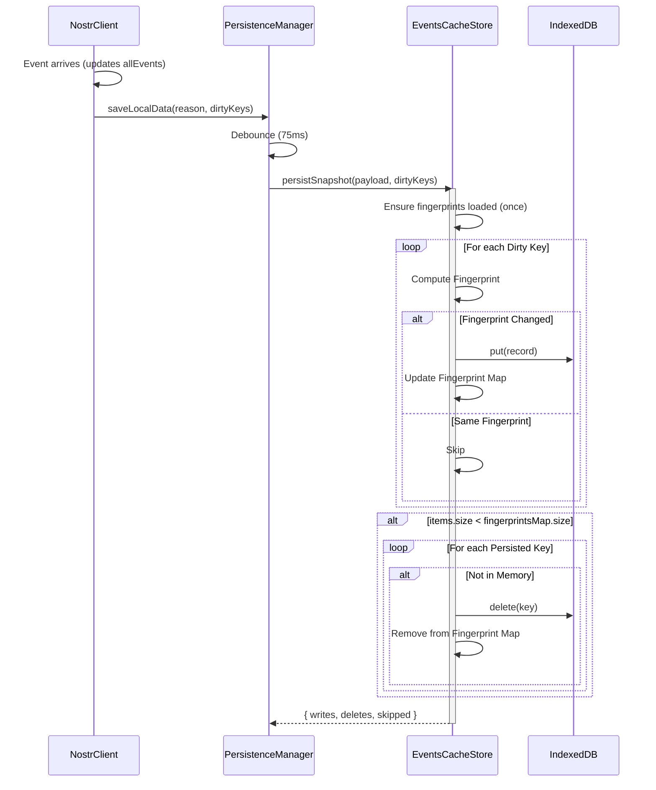

# EventsCacheStore Overview

The `EventsCacheStore` is a specialized persistence layer designed to handle the application's critical state: thousands of video events and their deletion status (tombstones). It uses **IndexedDB** as the primary storage backend, falling back to `localStorage` (via `PersistenceManager`) only if IDB is unavailable.

## 1. Problem Statement

Nostr clients must handle high-volume event streams. Storing every event naively to disk on every change causes:
- **Write Trashing**: Frequent, redundant writes degrade performance and battery life.
- **I/O Blocking**: Large JSON serializations on the main thread cause UI jank.
- **Startup Latency**: Reading thousands of small files or one giant blob is slow.

## 2. Architecture: Incremental Persistence

`EventsCacheStore` solves this with a **Differential State Snapshot** approach.

### Key Concepts

1.  **Memory Fingerprints**:
    - The store maintains a `Map<ID, Fingerprint>` in memory, mirroring what is currently on disk.
    - `Event Fingerprint`: `JSON.stringify(videoObject)` (fast enough for 1000s of items).
    - `Tombstone Fingerprint`: `ts:<timestamp>`.

2.  **Debounced Snapshots**:
    - `PersistenceManager` debounces writes (e.g., 75ms). When a write triggers, it passes the *entire* current state (`allEvents`) plus a set of `dirtyKeys` (IDs that changed since last save).

3.  **The Diff Algorithm (`_diffAndStore`)**:
    - Instead of clearing and rewriting the DB, it iterates over the `dirtyKeys`.
    - It computes the new fingerprint.
    - **Optimization**: If `newFingerprint === persistedFingerprint`, the write is skipped.
    - If different, it performs a `put()` operation and updates the memory fingerprint map.

4.  **Deletion Detection**:
    - After processing updates, it compares the size of the memory state (`items.size`) vs the persisted state (`fingerprintsMap.size`).
    - Since `fingerprintsMap` is updated during the loop to include new items, if `items.size < fingerprintsMap.size`, it implies some items in the persisted map are no longer in memory.
    - In this case, it iterates the *entire* fingerprint map to find and `delete()` the missing keys.

### Flow Diagram

## 3. Data Schema

The IndexedDB `bitvid-events-cache` (v1) contains three object stores:

| Store | Key Path | Value Description |
| :--- | :--- | :--- |
| `events` | `id` | `{ id, video, fingerprint }` |
| `tombstones` | `key` | `{ key, timestamp, fingerprint }` |
| `meta` | `key` | `{ key: "meta", savedAt: <ts>, version: 1 }` |

## 4. Invariants & Assumptions

- **Single Threaded**: The store assumes it is the only writer. It does not handle cross-tab locking (though IDB transactions provide atomicity).
- **Memory-First**: The `allEvents` Map in memory is the source of truth. IDB is a cache.
- **TTL**: On `restoreSnapshot()`, if the data is older than the TTL (e.g. 10 minutes), the entire cache is wiped to ensure freshness.

## 5. Maintenance

- **Adding Fields**: If the `Video` object shape changes, the fingerprint (JSON string) automatically changes, forcing a rewrite. No migration needed for content changes.
- **Schema Changes**: To add a new store, increment `EVENTS_CACHE_DB_VERSION` and update `onupgradeneeded` in `getDb()`.
