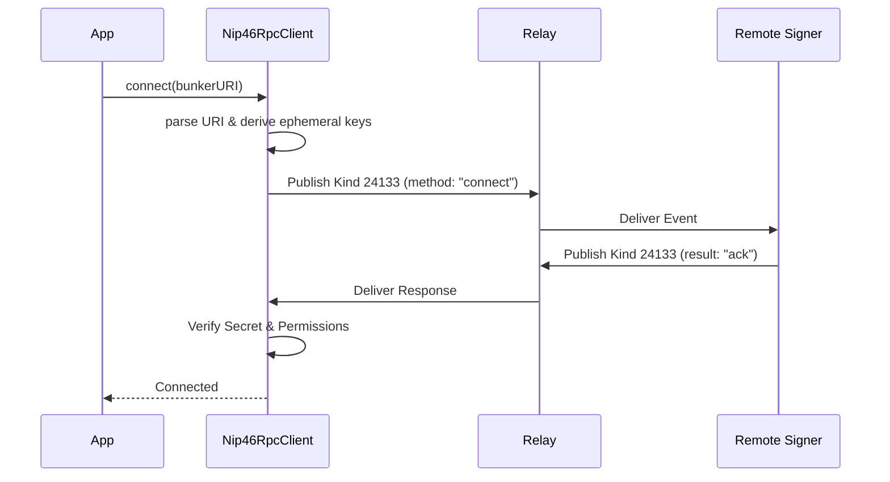
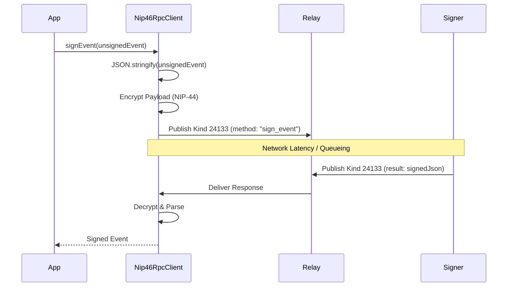

# NIP-46 Client Overview

`js/nostr/nip46Client.js` implements the **Nostr Connect** (NIP-46) protocol, allowing the application to delegate event signing to a remote signer (e.g., a "Bunker" or mobile wallet) instead of managing private keys locally.

## Architecture

The communication happens over standard Nostr relays using **Kind 24133** (Nostr Connect) events. These events act as an RPC (Remote Procedure Call) transport layer.

### Components

1.  **`Nip46RpcClient`**: The central controller. It manages:
    *   **Encryption**: Secures payloads using NIP-44 (XChaCha20) or NIP-04 (legacy AES).
    *   **Subscription**: Listens for responses from the specific remote signer pubkey.
    *   **Queueing**: Uses `Nip46RequestQueue` to serialize and throttle requests (preventing "rate-limited" errors).
    *   **Session**: Persists connection details (remote pubkey, relays) to `localStorage`.

2.  **`Nip46RequestQueue`**: A priority queue ensuring RPC calls are processed sequentially and respect relay rate limits.

### Connection Flow

1.  **Parsing**: The app receives a connection URI (e.g., `bunker://...` or `nostrconnect://...`).
2.  **Handshake**: `Nip46RpcClient` initiates a `connect` RPC call.
3.  **Verification**: If a `secret` was provided in the URI, the client verifies the signer's response matches it.
4.  **Metadata**: The client fetches the user's public key via `get_public_key`.

## Signing Flow

When the app needs to publish a video or update a profile, it calls `signEvent`.

## Security & Encryption

*   **Ephemeral Keys**: The client generates a random local key pair for each session. The user's main private key is **never** transmitted.
*   **Encryption Negotiation**: The client prefers **NIP-44 v2** but falls back to NIP-04 if the signer doesn't support it.
*   **Auth Challenges**: If the signer requires out-of-band authentication (e.g., scanning a QR code), it returns an `auth_url` error, which the client bubbles up to the UI.

## Key Functions

*   `parseNip46ConnectionString(uri)`: specific parser for `bunker://` and `nostrconnect://` URIs, extracting secrets, relays, and remote pubkeys.
*   `createNip46Cipher(...)`: Factory that creates an encryption interface (encrypt/decrypt) based on available libraries and negotiated algorithms.
*   `decryptNip46PayloadWithKeys(...)`: Helper to brute-force decrypt an incoming message using all available algorithms (handling legacy vs modern formats).

## Error Handling

*   **Timeouts**: RPC calls have a default timeout (15s).
*   **Rate Limiting**: If relays reply with `rate-limited`, the client performs exponential backoff.
*   **Session Recovery**: On page load, `readStoredNip46Session` rehydrates the session from `localStorage` to resume without re-connecting.

## When to change

*   **Protocol Updates**: If NIP-46 or NIP-44 standards are updated (e.g. new encryption vectors, new RPC methods).
*   **Security Audit**: If a security review identifies weaknesses in the ephemeral key handling or encryption flow.
*   **Relay Logic**: If the strategy for relay selection or rate-limiting needs to be optimized for better connectivity.
