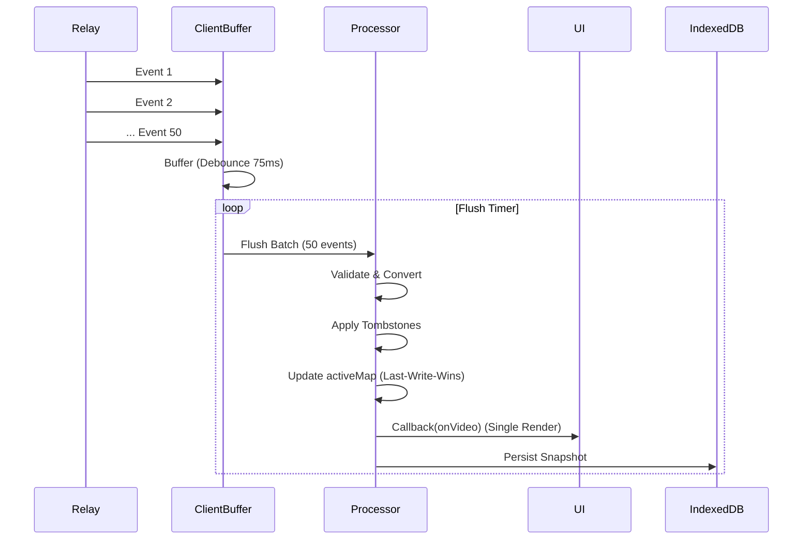

# NostrClient Overview

`NostrClient` (`js/nostr/client.js`) is the central controller for all Nostr network interactions, state management, and persistence in the application. It acts as the bridge between the raw Nostr protocol (relays, events) and the application's UI domain model (Videos, Profiles).

## Core Responsibilities

1.  **Connection Management**: Maintains a pool of WebSocket connections to relays via `nostr-tools/SimplePool`.
2.  **Event Processing**: Subscribes to event streams, buffers incoming bursts, validates schemas, and converts raw events into domain objects.
3.  **State Management**:
    *   **`allEvents`**: A complete history of every video version fetched.
    *   **`activeMap`**: A materialized view of the *latest* valid version of each video series (deduplicated by Root ID).
    *   **`tombstones`**: A set of deletion timestamps to prevent "zombie" events (deleted items reappearing from old caches) from being displayed.
4.  **Persistence**: Implements a "Stale-While-Revalidate" strategy using IndexedDB (with LocalStorage fallback) to restore the UI instantly on load.
5.  **Signer Orchestration**: Manages NIP-07 (Browser Extension), NIP-46 (Remote/Bunker), and Local (nsec) signers.

## State Management Architecture

The client maintains three primary maps to handle the "Eventual Consistency" nature of Nostr:

*   **`allEvents` (`Map<EventID, Video>`)**:
    *   Stores every valid video event received.
    *   Used for history hydration (viewing edit logs) and debugging.
*   **`activeMap` (`Map<RootID, Video>`)**:
    *   Stores only the *most recent* version of a video.
    *   Keyed by `videoRootId` (or `pubkey:dTag` for legacy).
    *   **Invariant**: `activeMap.get(id).created_at` is always >= any other version of that ID.
*   **`tombstones` (`Map<RootID, Timestamp>`)**:
    *   Stores the timestamp of the latest deletion event for a video.
    *   **Invariant**: Any event with `created_at <= tombstone` is implicitly treated as deleted, even if the "deleted" flag isn't set on the event itself. This handles out-of-order delivery where a "delete" arrives before the "video" it deletes.

## Caching Strategy

The client uses a multi-layered approach to ensure fast boot times:

1.  **IndexedDB (`events` store)**:
    *   Primary cache for video events.
    *   Stores fingerprints of objects to avoid redundant writes.
2.  **LocalStorage (`bitvid:eventsCache:v1`)**:
    *   Fallback if IndexedDB is unavailable.
    *   Size-limited (typically < 5MB).
3.  **Buffering**:
    *   Incoming events are buffered in memory and flushed to IDB periodically (debounced) to avoid I/O thrashing during heavy relay traffic.

## Event Processing (Buffering & Debouncing)

When `subscribeVideos` is called, the client expects a flood of events (e.g., 500+ items from relay history). Processing these one-by-one would freeze the UI.

### Flow

## History Reconstruction

Videos in Nostr are immutable events. "Editing" means publishing a new event with the same identifier. `NostrClient` reconstructs the history chain using:

1.  **`videoRootId` (V3)**: The canonical identifier for a video series.
2.  **`d` Tag (NIP-33)**: The addressable identifier.
3.  **Legacy IDs**: Fallback to Event ID for V1/V2 posts.

`hydrateVideoHistory` fetches all events matching these identifiers, sorts them by `created_at` descending, and returns the full edit log.

## Why it works this way

*   **Eventual Consistency**: The `tombstones` map is essential because relays guarantee neither order nor completeness. A client might receive a "delete" event for a video it hasn't seen yet, or receive an old version of a video after receiving the deletion. Tombstones ensure that once something is known to be deleted, it stays deleted (until a newer re-creation event appears).
*   **Performance**: The `eventBuffer` mechanism allows the client to ingest thousands of events without blocking the main thread, as React rendering is expensive. Batching updates reduces render cycles from O(N) to O(1) per batch.
*   **Offline-First**: Restoring from IndexedDB immediately allows the app to be interactive before any network connection is established.

## When to change

*   **Storage Backend**: If the cache schema becomes too complex for IndexedDB, or if we move to a native wrapper (React Native/Tauri) with a SQL backend, the `EventsCacheStore` class should be swapped out.
*   **Event Loop**: If we switch to a worker-based architecture (off-main-thread processing), the `subscribeVideos` logic would move to a Web Worker, and `NostrClient` would become a message passer.
*   **Protocol Upgrades**: If NIP-33 (Parameterized Replaceable Events) is superseded or the video event kind (30078) changes, the filters in `subscribeVideos` and `fetchVideos` must be updated.
