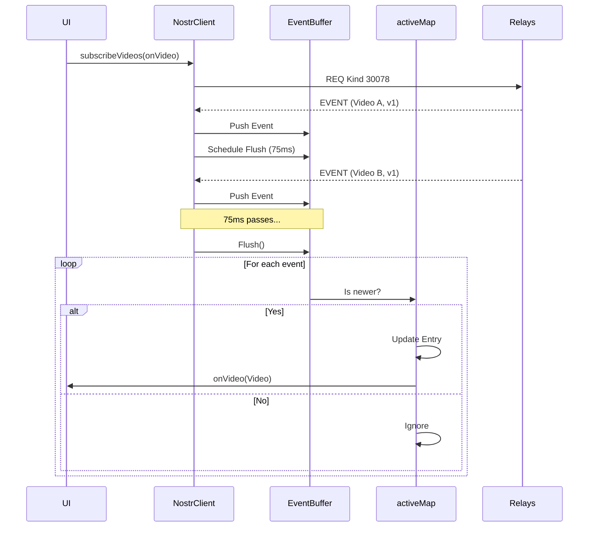

# NostrClient Overview

`NostrClient` (`js/nostr/client.js`) is the central controller for all Nostr network interactions and state management in the application. It acts as a facade over `nostr-tools`, managing connections to multiple relays, signing events, and maintaining the local application state.

## Responsibilities

1.  **Connection Management**: Maintains a pool of connections to configured Nostr relays. It handles initialization, reconnection, and error logging.
2.  **Event Publishing**: Handles the creation, signing, and broadcasting of various Nostr event kinds (Video Post: 30078, Reaction: 7, Comment: 1, etc.). It supports NIP-07 (Extension), NIP-46 (Remote/Bunker), and NIP-01 (Local nsec) signers.
3.  **State Management**:
    *   `allEvents`: A raw map of all fetched video events (Kind 30078), preserving history.
    *   `activeMap`: A derived map containing only the *latest* version of each video, deduplicated by `videoRootId` or `d` tag. This is the source of truth for the UI.
    *   `rawEvents`: A cache of the exact raw JSON events from relays, used for signature verification and republishing.
    *   `tombstones`: Tracks deletion timestamps to prevent deleted events from reappearing.
4.  **Caching**: Implements a dual-layer cache (`IndexedDB` + `localStorage`) to persist `activeMap`, `allEvents`, and `tombstones`. This allows the app to restore its state instantly on load ("stale-while-revalidate").
5.  **Video Lifecycle**: Manages the full lifecycle of a video post: Publish -> Edit (new event with same `d` tag) -> Revert (new event, same `d`, deleted flag) -> Delete (Kind 5).

## Key Concepts

### Active Video Logic
Nostr is an append-only protocol. Edits are new events. `NostrClient` implements "latest-wins" logic to present a coherent view:
- **Identifier**: Videos are identified by a `videoRootId` (in the content) or a NIP-33 `d` tag.
- **Resolution**: When a new event arrives, the client checks if it's newer than the current active version in `activeMap`. If so, it replaces the entry.
- **Deletions**: If an event has `deleted: true` or is a Kind 5 deletion, it is removed from `activeMap`, and a tombstone is recorded.

### Buffering & Debouncing
To handle high volumes of events (e.g., during initial relay dump), `subscribeVideos` uses a buffering strategy:
1.  Incoming events are pushed to `eventBuffer`.
2.  A flush is scheduled with a short debounce (e.g., 75ms).
3.  On flush, the batch is processed: validation, state updates, and UI notification.
This prevents UI thrashing.

### Tombstones
Because relays are eventually consistent, a deleted event might arrive *after* a deletion command.
- `tombstones` map `activeKey` -> `timestamp`.
- If an incoming event is older than the tombstone for its key, it is ignored (`applyTombstoneGuard`).

## Example Flow: `subscribeVideos`

## When to Modify

- **Adding a new Event Kind**: If the app needs to support a new type of interaction (e.g., playlists), add the handling logic here and in `js/nostrEventSchemas.js`.
- **Changing Caching Strategy**: Modify `EventsCacheStore` or `persistLocalData` if the caching requirements change.
- **Updating Signing Logic**: Changes to NIP-07 or NIP-46 integration should be carefully reviewed here.

## Related Files

- `js/nostrEventSchemas.js`: Definitions of event structures.
- `js/nostr/nip71.js`: Helper logic for video categorization (NIP-71).
- `js/nostr/watchHistory.js`: Manages user watch history state.
