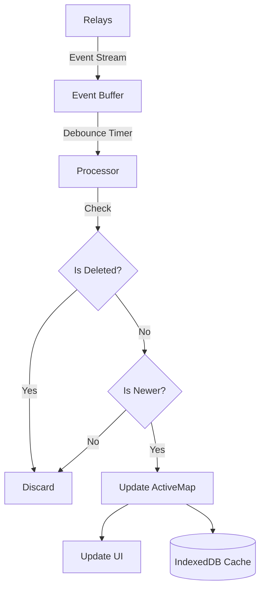

# NostrClient Architecture Overview

The `NostrClient` (`js/nostr/client.js`) is the central controller for all Nostr network interactions in the application. It acts as a singleton facade over the `nostr-tools` library, managing relay connections, event subscriptions, state synchronization, and cryptographic signing.

## Core Responsibilities

1.  **Connection Management**: Maintains a persistent connection pool (`SimplePool`) to multiple relays.
2.  **State Management**: Tracks the global state of video events, including history, active versions, and deletions.
3.  **Event Ingestion**: Handles high-volume event streams with buffering and deduplication.
4.  **Caching**: Implements a persistent IndexedDB cache to support "Stale-While-Revalidate" loading (instant UI render).
5.  **Signer Orchestration**: Manages NIP-07 (Browser Extension), NIP-46 (Remote Signer), and Local (nsec) signers seamlessly.

## State Management

The client maintains three primary state maps to ensure data consistency:

*   **`allEvents`** (`Map<string, VideoObject>`):
    *   Stores *every* valid video event fetched from relays, indexed by Event ID.
    *   Used for history preservation and resolving direct links to specific versions.

*   **`activeMap`** (`Map<string, VideoObject>`):
    *   The "materialized view" used by the UI.
    *   Keys are `videoRootId` (prefixed with `ROOT:`) for versioned edits, or `pubkey:dTag` for addressable events.
    *   Values are the *latest* valid version of the video.
    *   **Invariant**: Only one entry exists per "video entity", ensuring the UI displays the most recent edit.

*   **`tombstones`** (`Map<string, timestamp>`):
    *   Tracks deletions (Kind 5).
    *   Keys are the `activeKey` of the deleted item.
    *   Values are the timestamp of the deletion.
    *   **Invariant**: Events older than the tombstone are strictly ignored, preventing "zombie" events from reappearing.

## Data Ingestion Flow

The `subscribeVideos` method implements a buffered ingestion pipeline to handle high-throughput streams without freezing the UI:

1.  **Subscription**: Opens a subscription to all connected relays.
2.  **Buffering**: Incoming events are pushed to an `eventBuffer` array immediately.
3.  **Debouncing**: A timer flushes the buffer every ~75ms (or when full).
4.  **Processing (Flush)**:
    *   Events are parsed and validated.
    *   **Tombstone Check**: If an event predates a known deletion, it is discarded.
    *   **Latest-Wins Resolution**: The new event's `created_at` is compared against the existing entry in `activeMap`.
    *   **Update**: If the new event is newer, `activeMap` is updated, and the UI callback is triggered.
5.  **Persistence**: The updated state is asynchronously persisted to IndexedDB.

## Publishing Lifecycle

Creating and editing content involves a coordinated sequence of events to satisfy multiple NIPs:

1.  **Preparation**: The client normalizes the input (Title, Magnet, URL) and generates a unique `d` tag (NIP-33) and `videoRootId` (V3 Schema).
2.  **Signing**: The payload is signed by the active signer (Extension, NIP-46, or Local).
3.  **Primary Publish**: The main Kind 30078 event is broadcast to relays.
4.  **Mirroring (NIP-94)**: If a hosted URL is present, a Kind 1063 "File Header" event is *also* published. This ensures compatibility with generic file-sharing clients.
5.  **Tagging (NIP-71)**: If categories/tags are used, a Kind 22 event is published referencing the video. This keeps the main event payload lightweight.

## Deletion & Versioning

The client implements a robust deletion strategy to handle the immutable nature of Nostr events:

### Versioning
Edits are new events that share the same `d` tag and `videoRootId`. The client's `hydrateVideoHistory` method reconstructs the timeline by fetching all events with the matching `d` tag and sorting by `created_at`.

### Soft Delete (Revert)
The `revertVideo` method publishes a new version of the video where the content is replaced with a tombstone marker (`deleted: true`). This hides the video from the feed while preserving the history chain.

### Hard Delete (Nuclear Option)
The `deleteAllVersions` method attempts to physically remove data from relays (NIP-09):
1.  **Hydration**: Fetches the full history to identify every Event ID (`e` tags) and Address (`a` tags).
2.  **Tombstone**: Publishes a "Soft Delete" event to ensure immediate hiding.
3.  **Pruning**: Publishes a Kind 5 (Deletion) event listing *all* historical IDs. Relays respecting NIP-09 will delete the data.
4.  **Local Guard**: A local tombstone is recorded to prevent the client from re-displaying cached versions.

## Direct Messages

The client supports a dual-stack DM system to ensure compatibility and privacy:

*   **NIP-04 (Legacy)**:
    *   Uses simple ECDH encryption (Kind 4).
    *   **Pros**: Supported by almost all clients.
    *   **Cons**: Leaks metadata (who is talking to whom).
    *   **Usage**: Default fallback for text messages.

*   **NIP-17 (Private / Gift Wrap)**:
    *   Uses a "Russian Doll" onion encryption scheme (Kind 1059 -> Kind 13 -> Kind 14).
    *   **Pros**: Hides sender, receiver, and content from relays.
    *   **Cons**: Higher complexity and bandwidth.
    *   **Usage**: Required for attachments (images/videos) and strictly private conversations.

The `sendDirectMessage` method automatically selects the appropriate protocol based on the content (e.g., attachments force NIP-17).

## Caching Strategy (`EventsCacheStore`)

To provide an "app-like" experience, the client persists its state to IndexedDB (`bitvid-events-cache`).

*   **Fingerprinting**: To minimize I/O, the store tracks JSON fingerprints (hashes) of all persisted events.
*   **Incremental Persistence**: Only changed events (where fingerprint differs) are written to IDB during a snapshot.
*   **Stale-While-Revalidate**: On startup (`init()`), the client immediately loads data from IDB to render the UI, then connects to relays to fetch updates.

## Signer Integration

The client abstracts the signing mechanism, allowing the user to switch between methods without changing application logic:

1.  **NIP-07 (Extension)**: Delegates signing to a browser extension (e.g., Alby, nos2x).
2.  **NIP-46 (Remote/Bunker)**: Uses a partial `NostrClient` instance to communicate with a remote signer via a relay.
3.  **Local (NIP-01)**: Uses a local private key (nsec) stored in `sessionStorage` (encrypted).

The `activeSigner` object is normalized to expose a standard interface (`signEvent`, `nip04Encrypt`, `nip44Encrypt`), regardless of the underlying implementation.
