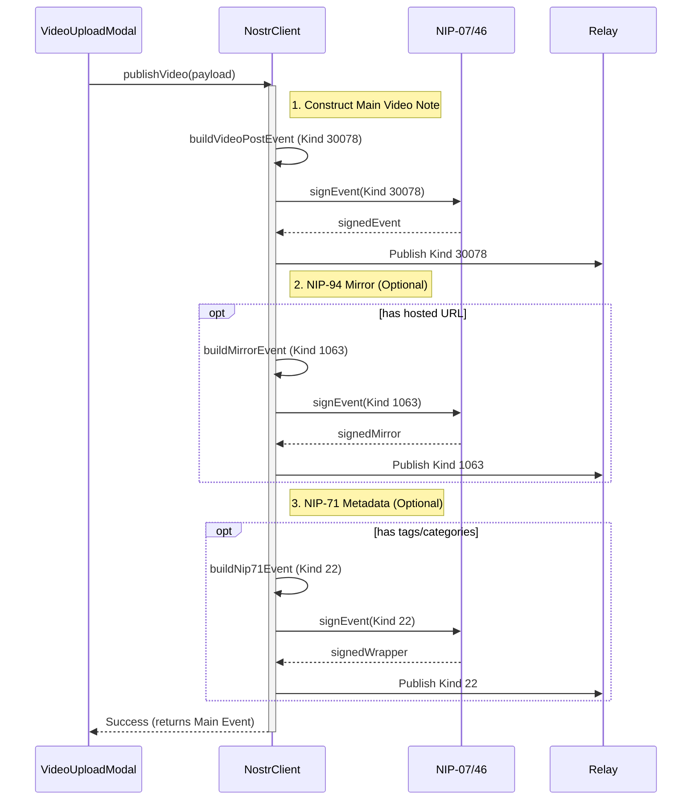

# NostrClient Overview

`js/nostr/client.js` exports the `NostrClient` class, which serves as the central controller for all Nostr protocol interactions in the application. It acts as a bridge between the UI components, the local state (React/Redux/Listeners), and the decentralized Nostr network.

## Responsibilities

1.  **Connection Management**:
    *   Maintains a persistent connection pool (`SimplePool` from `nostr-tools`) to multiple relays.
    *   Handles relay discovery, connection retries, and error reporting.
    *   Supports "Read" vs. "Write" relay splitting.

2.  **Event Publishing (Write Path)**:
    *   Constructs spec-compliant Nostr events (Kind 1, 30078, etc.).
    *   Handles **signing**:
        *   NIP-07 (Browser Extensions like Alby/nos2x).
        *   NIP-46 (Remote Signers / Bunker).
        *   Local Private Keys (nsec).
    *   Broadcasts events to write relays and verifies acceptance.
    *   Implements **NIP-94** (File Metadata) and **NIP-71** (Video Categorization) mirroring.

3.  **Data Fetching & Subscription (Read Path)**:
    *   **Live Feeds**: Uses persistent subscriptions (`sub`) to stream new events.
    *   **Buffering**: Implements a debounced buffer strategy (`subscribeVideos`) to handle relay floods without freezing the UI.
    *   **Caching**: Stores events in `allEvents` (memory) and persists to IndexedDB/LocalStorage for instant load ("Stale-While-Revalidate").

4.  **State Management**:
    *   **`allEvents`**: Map of all raw video events fetched, keyed by Event ID.
    *   **`activeMap`**: A "materialized view" of the latest video state. It deduplicates multiple versions of the same video (edits) based on `videoRootId` or `d` tag, ensuring the UI only shows the most recent valid version.
    *   **`tombstones`**: Tracks deleted events to prevent "zombie" events from reappearing during partial syncs.

## Key Architectures

### 1. The "Active Map" & Deduplication
Nostr is immutable; "editing" a video means publishing a NEW event with the same identifier (`d` tag).
The client listens to *all* versions but only keeps the latest one in `activeMap`.

```javascript
// Simplified Logic
if (incomingEvent.createdAt > currentActiveEvent.createdAt) {
  activeMap.set(videoRootId, incomingEvent);
  notifyUI();
}
```

### 2. Buffering Strategy
When the app loads, relays might send 1000+ events in a second. Rendering React components 1000 times is too slow.
`subscribeVideos` pushes events to a buffer and flushes them every 75ms.

```javascript
sub.on("event", (evt) => {
  buffer.push(evt);
  debounce(flushBuffer, 75);
});
```

### 3. Tombstoning (Deletes)
Since relays are eventually consistent, a "delete" event (Kind 5) might arrive *before* the event it deletes, or *after*.
The client tracks `tombstones` (map of ID -> deletedAt timestamp). Any incoming event older than its tombstone is immediately discarded.

## Main Entry Points

*   `init()`: Bootstraps the client, restores local cache, connects to relays.
*   `subscribeVideos(callback)`: Main feed subscription.
*   `publishVideo(payload)`: Complex flow to upload -> sign -> publish -> mirror.
*   `connectRemoteSigner(uri)`: Handshake protocol for NIP-46.

## Why it works this way

### 1. Immutability & "Active Map"
Nostr events are immutable signed messages. To support "edits", we must allow multiple events to represent the same "entity" (Video).
- **The Trade-off**: We accept higher memory usage (storing multiple versions in `allEvents`) to gain strict cryptographic verifiability.
- **The Solution**: `activeMap` acts as a "Latest-State Projection" (Materialized View) that the UI consumes. This decouples the network reality (append-only log) from the user expectation (mutable state).

### 2. Buffering vs. Streaming
Directly piping relay events to React State (`setState`) triggers a Re-Render Cycle for every message.
- **The Bottleneck**: Initial loads often fetch 500-2000 events in <2 seconds.
- **The Solution**: A 75ms debounce buffer collects bursts and processes them in one microtask. This turns 1000 re-renders into ~10-15, keeping the UI thread responsive (60fps).

### 3. Dual-Layer Caching (IDB + Memory)
Relays are slow and sometimes fail.
- **Offline-First**: We restore from IndexedDB immediately on boot (`init`).
- **Fingerprinting**: We hash events before writing to IDB. If `JSON.stringify(video)` hasn't changed, we skip the write syscall. This reduces I/O freezing on mobile devices.

## When to change

- **Update `EVENTS_CACHE_VERSION`**: If you change the internal `Video` object structure (e.g., rename fields in `convertEventToVideo`), bump the DB version in `EventsCacheStore` to force a wipe/rebuild on client devices.
- **Modify `subscribeVideos`**: If adding new filters (e.g., "Kids Only Mode"), update the subscription filter here. Ensure the buffer logic remains to protect performance.
- **Refactor Signers**: If NIP-46 changes or a new signer standard (NIP-XX) emerges, modify `signerHelpers.js` and `client.js` methods (`signAndPublishEvent`).

## Sequence Example: Publish Video

Publishing is not atomic; it's a multi-step orchestration to ensure compatibility across different Nostr clients (WebSeed vs. File Metadata vs. Categorization).


